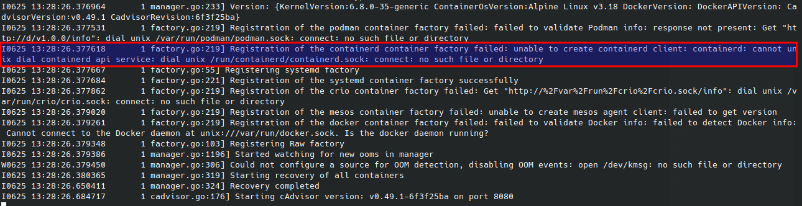

# Встановлення cAdvisor на MicroK8s (Draft)

## Проблема
Встановив cAdvisor на MicroK8s і побачив, що метрики на виході не мають таких лейбл, які допомогли б людині ідентифікувати под,
а також жодних лейблів, які б вказували на контейнер

Наприклад, якщо подивитися через ендпоінт для Prometheus (у мене це `http://127.0.0.1:8080/metrics`), то метрика має тільки одну лейблу - `id`.
Ось так виглядає, наприклад, метрика `container_last_seen` якогось контейнера з поду `loki-gateway`.
```
container_last_seen{id="/kubepods/besteffort/pod2712445f-3f3f-4617-8488-48cc3b7e14d4/d52592cd61d1d3eb0950527c0e9bc3108d50167674a39d1150487171bd743132"} 1.719322452e+09 1719322452970
```

Це UID поду, який можна дістати, наприклад, з метаданих маніфесту:
```shell
$ kubectl get pods loki-gateway-66c8f46897-2m445 -o jsonpath='{.metadata.uid}'
2712445f-3f3f-4617-8488-48cc3b7e14d4
```

Можна ідентифікувати под, але по-перше, не дуже зручно для людини, по-друге, ми не можемо ідентифікувати контейнер. До того ж,
в документації cAdvisor заявлено, що він має додавати лейбли з іменами поду, контейнера і неймспейса,
і це явно вказано опціями `store_container_labels` і `whitelisted_container_labels`,
значення по-замовчуванню для яких я наводжу нижче: 
```
--store_container_labels=false
--whitelisted_container_labels=io.kubernetes.container.name, io.kubernetes.pod.name,io.kubernetes.pod.namespace
```

// TODO я також отримував багато помилок від libcontainer (що це таке?), який мабуть використовується як fallback.
Адже бачимо в логах, що cadvisor намагається підключитися до всіх відомих йому джерел інформації, як то
docker, cri-o, containerd та інші.

// TODO
```
kubectl get --raw /api/v1/nodes/nuc-1/proxy/metrics/cadvisor | grep -i container_last_seen | grep "nginx"

container_last_seen{container="nginx",id="/kubepods/besteffort/pod2712445f-3f3f-4617-8488-48cc3b7e14d4/d52592cd61d1d3eb0950527c0e9bc3108d50167674a39d1150487171bd743132",image="docker.io/nginxinc/nginx-unprivileged:1.24-alpine",name="d52592cd61d1d3eb0950527c0e9bc3108d50167674a39d1150487171bd743132",namespace="default",pod="loki-gateway-66c8f46897-2m445"} 1.719322273e+09 1719322273039
```

## Пошуки причин
// TODO

Скачати репозиторій з маніфестами.

Зробив кастомізацію. Додав параметр `--v=2`, щоб збільшити verbosity логу. Без неї в лозі нічого корисного я не знайшов.

Ось і що бачимо в логах. cAdvisor намагається зв'язатися з `containerd` (саме цей рантайм використовує MicroK8s),
але не знаходить сокет:


Імовірно через те, що MicroK8s встановлений через snap-менеджер, сокет 
має нестандартне розміщення (`/var/snap/microk8s/common/run/containerd.sock`).
Імовірно, розташування змінили, щоб `containerd`, встановлений через `snap`, не конфліктував
з `containerd`, який може бути встановлений безпосередньо на хост.

На щастя, бінарнику `cadvisor` можна вказати розташування сокету `containerd`. Для цього існує відповідний параметр:

```
-containerd string
    containerd endpoint (default "/run/containerd/containerd.sock")
```

А репозиторій cAdvisor містить маніфести і [приклади кастомізацій](https://github.com/google/cadvisor/tree/master/deploy/kubernetes/overlays/examples).
На основі цих прикладів я створив власну кастомізацію, в яку і додав необхідні зміни, а саме:
- додав аргумент `--containerd=/var/snap-run/containerd.sock`;
- примонтував директорію `/var/snap/microk8s/common/run` у контейнер як `/var/snap-run`.


## Після фікса
// TODO


http://127.0.0.1:8080/metrics
```
container_last_seen{container_label_io_kubernetes_container_name="nginx",container_label_io_kubernetes_pod_name="loki-gateway-66c8f46897-2m445",container_label_io_kubernetes_pod_namespace="default",id="/kubepods/besteffort/pod2712445f-3f3f-4617-8488-48cc3b7e14d4/d52592cd61d1d3eb0950527c0e9bc3108d50167674a39d1150487171bd743132",image="docker.io/nginxinc/nginx-unprivileged:1.24-alpine",name="d52592cd61d1d3eb0950527c0e9bc3108d50167674a39d1150487171bd743132"}
```

```
kubectl get --raw /api/v1/nodes/nuc-1/proxy/metrics/cadvisor | grep -i container_last_seen

container_last_seen{container="nginx",id="/kubepods/besteffort/pod2712445f-3f3f-4617-8488-48cc3b7e14d4/d52592cd61d1d3eb0950527c0e9bc3108d50167674a39d1150487171bd743132",image="docker.io/nginxinc/nginx-unprivileged:1.24-alpine",name="d52592cd61d1d3eb0950527c0e9bc3108d50167674a39d1150487171bd743132",namespace="default",pod="loki-gateway-66c8f46897-2m445"} 1.719320893e+09 1719320893634
```


## Kustomization
`deploy/kubernetes/overlays/my-patches/cadvisor-args.yaml`:
```yaml
apiVersion: apps/v1 # for Kubernetes versions before 1.9.0 use apps/v1beta2
kind: DaemonSet
metadata:
  name: cadvisor
  namespace: cadvisor
spec:
  template:
    spec:
      containers:
        - name: cadvisor
          args:
            - --housekeeping_interval=10s # kubernetes default args
            - --max_housekeeping_interval=15s
            - --event_storage_event_limit=default=0
            - --event_storage_age_limit=default=0
            - --enable_metrics=app,cpu,disk,diskIO,memory,network,process
            - --docker_only=false
            - --store_container_labels=false
            - --whitelisted_container_labels=io.kubernetes.container.name, io.kubernetes.pod.name,io.kubernetes.pod.namespace
            - --v=2
            - --containerd=/var/snap-run/containerd.sock
```

`deploy/kubernetes/overlays/my-patches/daemonset.yaml`:
```yaml
apiVersion: apps/v1 # for Kubernetes versions before 1.9.0 use apps/v1beta2
kind: DaemonSet
metadata:
  name: cadvisor
  namespace: cadvisor
spec:
  template:
    spec:
      containers:
        - name: cadvisor
          image: gcr.io/cadvisor/cadvisor:v0.49.1
          volumeMounts:
            - name: var-snap-run
              mountPath: /var/snap-run
              readOnly: true
      volumes:
        - name: var-snap-run
          hostPath:
            path: /var/snap/microk8s/common/run
```

deploy/kubernetes/overlays/my-patches/kustomization.yaml:
```yaml
apiVersion: kustomize.config.k8s.io/v1beta1
kind: Kustomization
resources:
- ../../base
patches:
- path: cadvisor-args.yaml
```

Щоб згенерувати і одразу застосувати до кластеру:
```shell
kustomize build ./deploy/kubernetes/overlays/my-patches/ | kubectl apply -f -
```


## `cadvisor`
```
$ kubectl exec cadvisor-zphg8 -n cadvisor -- cadvisor --version
cAdvisor version v0.49.1 (6f3f25ba)


$ kubectl exec cadvisor-zphg8 -n cadvisor -- cadvisor --help
Usage of cadvisor:
  -add_dir_header
        If true, adds the file directory to the header of the log messages
  -allow_dynamic_housekeeping
        Whether to allow the housekeeping interval to be dynamic (default true)
  -alsologtostderr
        log to standard error as well as files (no effect when -logtostderr=true)
  -application_metrics_count_limit int
        Max number of application metrics to store (per container) (default 100)
  -boot_id_file string
        Comma-separated list of files to check for boot-id. Use the first one that exists. (default "/proc/sys/kernel/random/boot_id")
  -bq_account string
        Service account email
  -bq_credentials_file string
        Credential Key file (pem)
  -bq_id string
        Client ID
  -bq_project_id string
        Bigquery project ID
  -bq_secret string
        Client Secret (default "notasecret")
  -collector_cert string
        Collector's certificate, exposed to endpoints for certificate based authentication.
  -collector_key string
        Key for the collector's certificate
  -container_hints string
        location of the container hints file (default "/etc/cadvisor/container_hints.json")
  -containerd string
        containerd endpoint (default "/run/containerd/containerd.sock")
  -containerd-namespace string
        containerd namespace (default "k8s.io")
  -containerd_env_metadata_whitelist env_metadata_whitelist
        DEPRECATED: this flag will be removed, please use env_metadata_whitelist. A comma-separated list of environment variable keys matched with specified prefix that needs to be collected for containerd containers
  -crio_client_timeout duration
        CRI-O client timeout. Default is no timeout.
  -disable_metrics metrics
        comma-separated list of metrics to be disabled. Options are advtcp,app,cpu,cpuLoad,cpu_topology,cpuset,disk,diskIO,hugetlb,memory,memory_numa,network,oom_event,percpu,perf_event,process,referenced_memory,resctrl,sched,tcp,udp. (default advtcp,cpu_topology,cpuset,hugetlb,memory_numa,process,referenced_memory,resctrl,sched,tcp,udp)
  -disable_root_cgroup_stats
        Disable collecting root Cgroup stats
  -docker string
        docker endpoint (default "unix:///var/run/docker.sock")
  -docker-tls
        use TLS to connect to docker
  -docker-tls-ca string
        path to trusted CA (default "ca.pem")
  -docker-tls-cert string
        path to client certificate (default "cert.pem")
  -docker-tls-key string
        path to private key (default "key.pem")
  -docker_env_metadata_whitelist env_metadata_whitelist
        DEPRECATED: this flag will be removed, please use env_metadata_whitelist. A comma-separated list of environment variable keys matched with specified prefix that needs to be collected for docker containers
  -docker_only
        Only report docker containers in addition to root stats
  -docker_root string
        DEPRECATED: docker root is read from docker info (this is a fallback, default: /var/lib/docker) (default "/var/lib/docker")
  -enable_load_reader
        Whether to enable cpu load reader
  -enable_metrics metrics
        comma-separated list of metrics to be enabled. If set, overrides 'disable_metrics'. Options are advtcp,app,cpu,cpuLoad,cpu_topology,cpuset,disk,diskIO,hugetlb,memory,memory_numa,network,oom_event,percpu,perf_event,process,referenced_memory,resctrl,sched,tcp,udp.
  -env_metadata_whitelist string
        a comma-separated list of environment variable keys matched with specified prefix that needs to be collected for containers, only support containerd and docker runtime for now.
  -event_storage_age_limit string
        Max length of time for which to store events (per type). Value is a comma separated list of key values, where the keys are event types (e.g.: creation, oom) or "default" and the value is a duration. Default is applied to all non-specified event types (default "default=24h")
  -event_storage_event_limit string
        Max number of events to store (per type). Value is a comma separated list of key values, where the keys are event types (e.g.: creation, oom) or "default" and the value is an integer. Default is applied to all non-specified event types (default "default=100000")
  -global_housekeeping_interval duration
        Interval between global housekeepings (default 1m0s)
  -housekeeping_interval duration
        Interval between container housekeepings (default 1s)
  -http_auth_file string
        HTTP auth file for the web UI
  -http_auth_realm string
        HTTP auth realm for the web UI (default "localhost")
  -http_digest_file string
        HTTP digest file for the web UI
  -http_digest_realm string
        HTTP digest file for the web UI (default "localhost")
  -listen_ip string
        IP to listen on, defaults to all IPs
  -log_backtrace_at value
        when logging hits line file:N, emit a stack trace
  -log_cadvisor_usage
        Whether to log the usage of the cAdvisor container
  -log_dir string
        If non-empty, write log files in this directory (no effect when -logtostderr=true)
  -log_file string
        If non-empty, use this log file (no effect when -logtostderr=true)
  -log_file_max_size uint
        Defines the maximum size a log file can grow to (no effect when -logtostderr=true). Unit is megabytes. If the value is 0, the maximum file size is unlimited. (default 1800)
  -logtostderr
        log to standard error instead of files (default true)
  -machine_id_file string
        Comma-separated list of files to check for machine-id. Use the first one that exists. (default "/etc/machine-id,/var/lib/dbus/machine-id")
  -max_housekeeping_interval duration
        Largest interval to allow between container housekeepings (default 1m0s)
  -max_procs int
        max number of CPUs that can be used simultaneously. Less than 1 for default (number of cores).
  -mesos_agent string
        Mesos agent address (default "127.0.0.1:5051")
  -mesos_agent_timeout duration
        Mesos agent timeout (default 10s)
  -one_output
        If true, only write logs to their native severity level (vs also writing to each lower severity level; no effect when -logtostderr=true)
  -perf_events_config string
        Path to a JSON file containing configuration of perf events to measure. Empty value disabled perf events measuring.
  -podman string
        podman endpoint (default "unix:///var/run/podman/podman.sock")
  -port int
        port to listen (default 8080)
  -profiling
        Enable profiling via web interface host:port/debug/pprof/
  -prometheus_endpoint string
        Endpoint to expose Prometheus metrics on (default "/metrics")
  -raw_cgroup_prefix_whitelist string
        A comma-separated list of cgroup path prefix that needs to be collected even when -docker_only is specified
  -referenced_reset_interval uint
        Reset interval for referenced bytes (container_referenced_bytes metric), number of measurement cycles after which referenced bytes are cleared, if set to 0 referenced bytes are never cleared (default: 0)
  -resctrl_interval duration
        Resctrl mon groups updating interval. Zero value disables updating mon groups.
  -skip_headers
        If true, avoid header prefixes in the log messages
  -skip_log_headers
        If true, avoid headers when opening log files (no effect when -logtostderr=true)
  -stderrthreshold value
        logs at or above this threshold go to stderr when writing to files and stderr (no effect when -logtostderr=true or -alsologtostderr=false) (default 2)
  -storage_driver driver
        Storage driver to use. Data is always cached shortly in memory, this controls where data is pushed besides the local cache. Empty means none, multiple separated by commas. Options are: <empty>, bigquery, elasticsearch, influxdb, kafka, redis, statsd, stdout
  -storage_driver_buffer_duration duration
        Writes in the storage driver will be buffered for this duration, and committed to the non memory backends as a single transaction (default 1m0s)
  -storage_driver_db string
        database name (default "cadvisor")
  -storage_driver_es_enable_sniffer
        ElasticSearch uses a sniffing process to find all nodes of your cluster by default, automatically
  -storage_driver_es_host string
        ElasticSearch host:port (default "http://localhost:9200")
  -storage_driver_es_index string
        ElasticSearch index name (default "cadvisor")
  -storage_driver_es_type string
        ElasticSearch type name (default "stats")
  -storage_driver_host string
        database host:port (default "localhost:8086")
  -storage_driver_influxdb_retention_policy string
        retention policy
  -storage_driver_kafka_broker_list string
        kafka broker(s) csv (default "localhost:9092")
  -storage_driver_kafka_ssl_ca string
        optional certificate authority file for TLS client authentication
  -storage_driver_kafka_ssl_cert string
        optional certificate file for TLS client authentication
  -storage_driver_kafka_ssl_key string
        optional key file for TLS client authentication
  -storage_driver_kafka_ssl_verify
        verify ssl certificate chain (default true)
  -storage_driver_kafka_topic string
        kafka topic (default "stats")
  -storage_driver_password string
        database password (default "root")
  -storage_driver_secure
        use secure connection with database
  -storage_driver_table string
        table name (default "stats")
  -storage_driver_user string
        database username (default "root")
  -storage_duration duration
        How long to keep data stored (Default: 2min). (default 2m0s)
  -store_container_labels
        convert container labels and environment variables into labels on prometheus metrics for each container. If flag set to false, then only metrics exported are container name, first alias, and image name (default true)
  -update_machine_info_interval duration
        Interval between machine info updates. (default 5m0s)
  -url_base_prefix string
        prefix path that will be prepended to all paths to support some reverse proxies
  -v value
        number for the log level verbosity
  -version
        print cAdvisor version and exit
  -vmodule value
        comma-separated list of pattern=N settings for file-filtered logging
  -whitelisted_container_labels string
        comma separated list of container labels to be converted to labels on prometheus metrics for each container. store_container_labels must be set to false for this to take effect.
```
